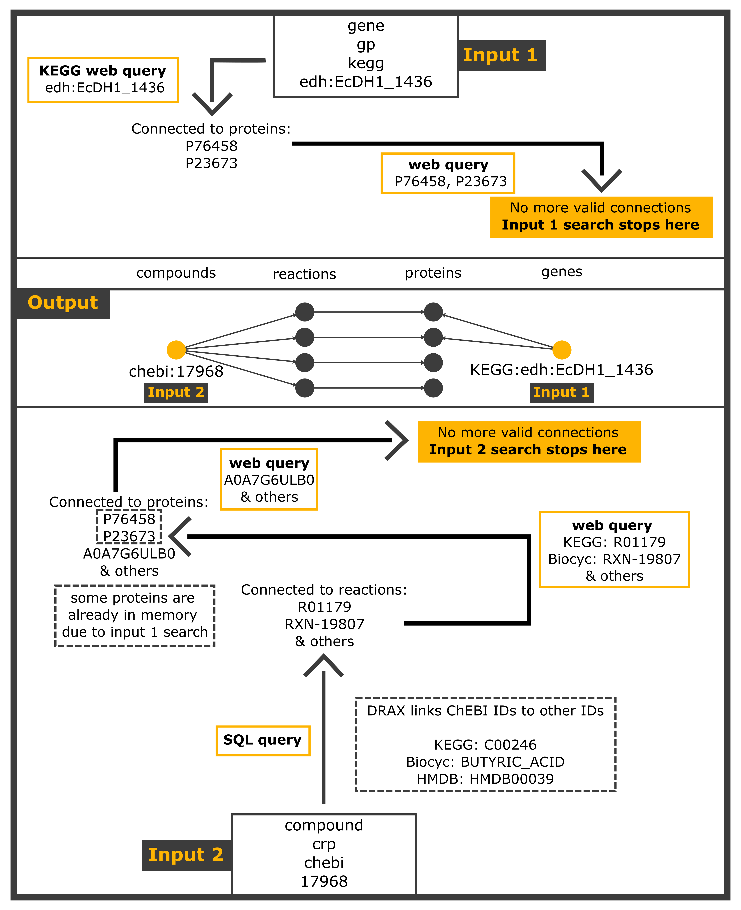

# UniFuncNet

UniFuncNet is a network annotation tool, fetching information on multiple entities and establishing gene-protein-reaction-compound relationships across multiple databases.
It was built to aid in the mapping of metabolism related entities, for example to aid in the expansion of metabolic networks, automating the often monotonous, manual data collection.

## Installation

1. `git clone git@github.com:PedroMTQ/UniFuncNet.git`  
2. Go to the cloned UniFuncNet folder and run `conda env create -f unifuncnet_env.yml`
3. Run `conda activate unifuncnet_env`
4. *optional* Request [Metacyc license](https://metacyc.org/download.shtml)
5. *optional* Download the `Metacyc flat files`
6. *optional* Export files in data to `UniFuncNet/Resources/metacyc/`
7. *optional* `UniFuncNet/Resources/metacyc/` should contain: `compounds.dat`,`proteins.dat`,`reactions.dat`,`gene-links.dat`, and `genes.dat`,

**Using Metacyc is technically optional (as all databases) but since it contains high quality information, using it is usually desirable**

## Using UniFuncNet

You can run the code below to test the execution:

    unifuncnet --example

A typical run would look like:

    unifuncnet -i input.tsv

To avoid overloading these database websites, a 10 seconds pause between requests was added.

UniFuncNet accepts the following parameters:

    unifuncnet -i input_path -o output_folder -db metacyc,kegg,hmdb,rhea,uniprot,pubchem -pt 10

    Mandatory arguments: --input_path / -i
    Optional arguments:  --output_folder / -o
                         --databases / -db

Where each parameter corresponds to the following:

- `input_path` - the input tsv file path.
- `output_folder` - the output folder where the spreadsheets are stored
- `databases ` - databases that UniFuncNet can search in, by default `metacyc,kegg,hmdb,rhea,uniprot,pubchem`
- `politeness_timer` - time (seconds) between requests. Default is 10. Please be careful not to overleaf the corresponding databases, you might get blocked from doing future requests.

Data is  retrieved according to the information provided, for example, if the user provides the KEGG gene ID hsa:150763, then, given that the gpr search mode is used, UniFuncNet would fetch information on this gene, the KEGG protein entries connected to this gene (i.e., 2.3.1.15) and by extent the reactions these protein(s) catalyze (i.e., R00851,R02617,R09380).

- `search_type` - starting point of the search, if the user aims to provide IDs for proteins, then it would be `protein_search`, and the same for the other types of biological instances

### Running workflows

For more information on the workflows go to the respective [folder](Workflows/)

### Formatting input file

The input file should be a tab separated file that looks something like this:

| ID                          | ID type   | entity type | search mode |
|-----------------------------|-----------|-------------|-------------|
| HS08548                     | metacyc   | gene        |             |
| HMDBP00087                  | hmdb      | gene        | gp          |
| hsa:150763                  | kegg      | gene        | global      |
| P19367                      | uniprot   | gene        |             |
| 2.7.1.1                     | enzyme_ec | protein     | pr          |
| 2.7.1.2                     | kegg      | protein     | pg          |
| 2.7.1.3                     | metacyc   | protein     | prc         |
| FERREDOXIN-MONOMER          | metacyc   | protein     | prc         |
| HMDBP00609                  | hmdb      | protein     |             |
| K00844                      | kegg_ko   | protein     |             |
| P19367                      | uniprot   | protein     | prc,pg      |
| PROTOHEMEFERROCHELAT-RXN    | metacyc   | reaction    |             |
| 14073                       | hmdb      | reaction    |             |
| R02887                      | kegg      | reaction    | rpg,rc      |
| 10000                       | rhea      | reaction    | rp          |          
| CPD-520                     | metacyc   | compound    |             |
| 27531                       | chebi     | compound    | cp          |
| 962                         | pubchem   | compound    | cprg        |
| HMDB0000538                 | hmdb      | compound    | c           |
| C00093                      | kegg      | compound    |             |
| XLYOFNOQVPJJNP-UHFFFAOYSA-N | inchi_key | compound    |             |
| h1H20A                      | inchi     | compound    |             |
| water                       | synonyms  | compound    | cr          |

Each column is described below:

- column 1 - ID you want to search for
- column 2 - origin of the ID
- column 3 - entity type you provided the ID for
- column 4 -  the search mode, i.e., direction of the search, `global` for searching in both directions, and, for example, `rpg` for searching from reaction->protein->gene. You can also search only for the data associated with your input IDs without actually searching for connections by leaving this value blank. **Keep in mind you can use multiple search modes**, e.g., `rp,pr`, but this may result in redundant searches. At the moment these are all the valid directions of search:
  - 'gp'
  - 'gpr'
  - 'gprc'
  - 'pg'
  - 'pr'
  - 'prc'
  - 'rpg'
  - 'rp'
  - 'rc'
  - 'cr'
  - 'crp'
  - 'crpg'
  - 'global'
  - ''

Keep in mind UniFuncNet will always try to use all available IDs to search for more information. That is, if you start with a certain ID (e.g., kegg ID), if UniFuncNet finds searchable information for the other databases (in this case metacyc and hmdb) then it will also collect data from those databases. This applies to different entities as well, e.g., UniFuncNet starts with gene IDs from kegg, then finds the corresponding proteins for these genes in hmdb and metacyc; UniFuncNet (if the search mode is set to `gp,pg`) will then also find information on genes for these two additional databases.

Some type of IDs (i.e., `enzyme_ec` and `uniprot`) can be matched with multiple databases. `synonyms` and `chebi` can also be used to query multiple databases. For example, for the line `protein | pr | uniprot | P19367`, UniFuncNet will try to match this Uniprot ID with all the databases

Optionally, the user can include a fifth column with a list of KEGG organism IDs (e.g., \textit{hsa} for human),  which narrows down information retrieval during the gene->protein searching.

### Supported input IDs

Several IDs are allowed per biological instance:

- Reaction:
    - metacyc (e.g., "RXN66-521")
    - KEGG (e.g., "R02848")
    - HMDB (e.g., "14073")
    - Rhea (e.g., "10000")

- Protein:
    - enzyme EC number (e.g., "2.7.1.1")
    - KEGG (e.g., "2.7.1.1")
    - KEGG KO (e.g., "K00844")
    - metacyc (e.g., "2.7.1.1")
    - Uniprot (e.g., "P10632")
    - HMDB (e.g., "HMDBP00609")

- Gene:
    - KEGG (e.g., "hsa:150763")
    - Uniprot (e.g., "P10632")
    - metacyc (e.g., "HS08548")
    - HMDB (e.g., "HMDBP00087")

- Compound:
    - metacyc (e.g., the ID "WATER")
    - KEGG (e.g., "C00001")
    - HMDB (e.g., "HMDB02111")
    - InChI key (e.g., "XLYOFNOQVPJJNP-UHFFFAOYSA-N")
    - Chemspider (e.g., "937")
    - Synonym  (e.g., "water")

### Output

UniFuncNet outputs 5 tsv files: `Compounds.tsv`,`Reactions.tsv`,`Proteins.tsv`,`Genes.tsv`, and `Graph.sif`
Each of the first 4 files contain multiple instances (e.g., compound) with a tab-separated list of identifiers or other relevant information.
Specifically, all instances contain an `internal_id` which can be used for graph-based approaches cross-linking (e.g., `manuscript.py`), and often a list of identifiers and synonyms.
In the case of reactions, proteins and genes, cross-linking is available in the form of `<instance>_connected`. For example, if the user searches for all reactions of a set of proteins, then the retrieved proteins would have a list of `reactions_connected:<reaction internal_id>` depicting which reactions this protein is connected to. The same would apply for other search modes or search starting points.
Reactions also contain the list of compounds involved in this reaction, e.g.: `reaction_compounds:<C1> + <C2> <=> <C3> + <C4> + <C5>` where `CX` corresponds to a compound's `internal_id`.

Using the example above as an example (with input the enzyme EC 2.7.8.26), the output for each instance would look somewhat like:
- `Proteins.tsv`
  - internal_id:**270**	cas:DA85_04120	enzyme_ec:2.7.8.26	kegg_ko:K02233	reactions_connected:**25550**	genes_connected:**9035**	synonyms:adenosylcobinamide-gdp ribazoletransferase	synonyms:cobalamin (5'-phosphate) synthase	synonyms:cobalamin (5′-phosphate) synthase	synonyms:cobalamin synthase	synonyms:cobalamin-5'-phosphate synthase	synonyms:cobalamin-5′-phosphate synthase	synonyms:cobs	synonyms:α-ribazole ribazoletransferase
- `Reactions.tsv`
  - internal_id:**25550**	metacyc:RXN-19297	pathways:4-methylphenyl adenosylcobamide biosynthesis from adenosylcobinamide-GDP	reaction_compounds:**10310** + 6731 => 21252 + 24415 + 8385	reaction_str:adenosylcobinamide-GDP + 4-methylphenyl ribotide phosphate => 4-methylphenyl-Coβ-adenosylcobamide 5'-phosphate + GMP + H+
- `Compounds.tsv`
  - internal_id:**10310**	bigg:agdpcbi	metacyc:ADENOSYLCOBINAMIDE-GDP	chebi:60487	hmdb:HMDB12185	kegg:C06510	pubchem_cid:135398566	seed:cpd03920	synonyms:adenosine-gdp-cobinamide	synonyms:adenosylcobinamide-gdp

As can be seen, the protein (i.e., `internal_id:270`) shown above is connected to the reaction `25550` which in turn is described as the following interaction between compounds: 10310 + 6731 => 21252 + 24415 + 8385. These compounds are then listed in the `Compounds.tsv` as shown above. For visualization purposess only a small transcript is shown above.

The `Graph.sif` file contains edges between nodes (i.e. entities). For example since the protein with the internal id 270 is connected to the reaction with the internal id 25550, then there will be an edge between the **source** node 270 and the **target** node 25550. The third column in this file contains the type of interaction, which in this case would be from protein to reaction, i.e., **pr**.

### Example run

The example contains two inputs: in the first input line the KEGG gene edh:EcDH1\_1436 with the search mode "gp", and a second input line with the ChEBI compound ID 17968 with the search mode "crp". UniFuncNet starts by searching for information regarding the seed gene KEGG ID edh:EcDH1\_1436, parsing the result, creating a gene entity, and retrieving the connected proteins IDs (i.e., here UniProt IDs, P76458 and P23673). Since the search mode is "gp",UniFuncNet will do a new web query and search for the protein IDs in the available databases. UniFuncNet now retrieves information on these two proteins and creates two protein entities (one for each UniProt ID), and stops here. The connections between the gene seed entity and the protein entities constitute direct connections.
In the second seed input, UniFuncNet receives the ChEBI compound ID 17968, which it then cross-links to other databases through a ChEBI SQL database. This cross-linking connects the ChEBI ID 17968 to the metacyc ID BUTYRIC\_ACID, KEGG ID C00246 and HMDB ID HMDB0039. UniFuncNet then searches for information on these three compound IDs on each respective database, retrieving also information on the reactions these compounds are involved in. The information from each database is then merged internally into one single compound entity. Since the search mode is "crp", UniFuncNet starts a new round of data retrieval, querying each database for each reaction connected to the previous compound entity. During this reaction data retrieval, UniFuncNet also searches for information on all other compounds involved in these reactions (not shown in figure, but, e.g., for the reaction "Butanoyl-CoA + Acetate <=> Butanoic acid + Acetyl-CoA", UniFuncNet will not search for information on the seed compound "Butanoic acid" since it was previously searched, but it will search for information on the "Butanoyl-CoA", "Acetate", and "Acetyl-CoA" compounds). During this reaction search, UniFuncNet finds information on the proteins linked to these reactions, and, since the search mode is "crp", it then searches for information on these proteins. Among these proteins, there are two proteins (i.e., P76458 and P23673) which have been previously searched and so UniFuncNet does not repeat the same web query, it simply connects the reaction entities to these already existing protein entities. Having finished reading the inputs, UniFuncNet then outputs all this information, linking entities in a graph-based manner (notice how the two seed input IDs are connected in the output graph).

### On search modes

For example: the user inputs a gene ID, and the search mode `gprc`, UniFuncNet will then search for information on the gene, as well as any directly (proteins) or indirectly (reactions and compounds) connected entities.

Another example: should the user input be a gene ID and the search mode "gp" then data is first retrieved on the seed input gene ID, a seed entity is generated from this data, and (since the search mode is "gp") a new data retrieval iteration starts for the protein IDs connected to this seed entity. In this new iteration, data is retrieved for the protein IDs and the respective protein entities are generated.
Finally, while these entities may be associated with more gene IDs and reaction IDs, the search stops, since the search mode is "gp".

The search mode  `na` removes any type of extra search besides the initial IDs provided, meaning that if the user provides the KEGG gene ID hsa:150763, we would still search for it (and retrieve gene-related data) but we would not search for its respective proteins.

The search mode `global` is an extensive search, where we can search in both directions (i.e. g->p->r and r->p->g), meaning that if the user provides the KEGG gene ID hsa:150763 we would retrieve the respective proteins 2.3.1.15, but we would then also search for all the gene IDs for the protein 2.3.1.15 (e.g., hsa:150763, ptr:107971389, csab:103215676). The same would apply to the protein and reaction search.

Should the user provide a compound name (e.g. "water") the compound search may also retrieve related compounds (since UniFuncNet uses the each website's search bar to retrieve the most likely compound entry). However, if an ID is provided, UniFuncNet will first search for the ID, if information is not found, then the synonyms are used as a search method.
This also applies to when the option `reaction_metabolites` is enabled and the reaction does not contain any compound ID, in that case the reaction string (e.g. "sn-Glycerol 3-phosphate + Acyl-CoA <=> 1-Acyl-sn-glycerol 3-phosphate + CoA") is parsed  and its compounds are searched using the method previously described.
UniFuncNet can also search for information connected to compounds (i.e., reactions) by enabling the required search modes `rp,pr`

### Data models
UniFuncNet contains multiple entities types (i.e., genes, proteins, reactions, and compounds), which are implemented as different data models (i.e., Python classes)
These entities inherent methods from a general data model which is able to preserve information (such as database IDs) in memory (i.e., random access memory - RAM). Besides serving as temporary data storage, this general data model also contains methods for retrieval and editing of information, as well as, matching and merging of entities. Naturally, each specific component will also contain unique methods applicable only to its own component type (e.g., reactions). In this manner, through the use of object oriented programming, we effectively create a layer of abstraction that facilitates programmatic interaction with the entities.

For example, having collected data on a certain reaction into a python dictionary, a "Reaction" instance can be created, storing any information relevant to this data model type, such as the reaction string and database IDs. This reaction instance can then be interacted with using generic methods, e.g., UniFuncNet can connect this instance to any compound instances involved with this reaction.

While the data models for genes, reactions and compounds are well defined (both in computational and biological terms), proteins, in the context of web scraping, are somewhat more ambiguous entities (e.g., a protein complex can be subdivided into multiple database entries); therefore, in the context of UniFuncNet, protein entities roughly represent functions. This ambiguity is a necessity to build a generic protein data model that is able to integrate multiple databases into one consistent network. This effectively creates a layer of abstraction that facilitates programmatic interaction with the entities and any putative connections.

Using instances and connecting them through memory pointers, a network can be generated in RAM, where each instance represents a network node. Any of the individual instances in this network can then be accessed, edited or exported as necessary; in the case of UniFuncNet through a pre-determined workflow respecting the user input requirements. Such a framework, and it's corresponding application programming interface (API), has the added benefit of being quite general, thus being re-usable in scenarios that extend beyond the scope of UniFuncNet.

# License and copyright

This project is available under the [MIT license](https://github.com/PedroMTQ/UniFuncNet/LICENSE).

# References and acknowledgements

> Minoru Kanehisa, Susumu Goto, KEGG: Kyoto Encyclopedia of Genes and Genomes, Nucleic Acids Research, Volume 28, Issue 1, 1 January 2000, Pages 27–30, https://doi.org/10.1093/nar/28.1.27
>
> Caspi R, Billington R, Keseler IM, Kothari A, Krummenacker M, Midford PE, Ong WK, Paley S, Subhraveti P, Karp PD. The MetaCyc database of metabolic pathways and enzymes - a 2019 update. Nucleic Acids Res. 2020 Jan 8;48(D1):D445-D453. doi: 10.1093/nar/gkz862. PMID: 31586394; PMCID: PMC6943030.
>
> Wishart DS, Feunang YD, Marcu A, Guo AC, Liang K, Vázquez-Fresno R, Sajed T, Johnson D, Li C, Karu N, Sayeeda Z, Lo E, Assempour N, Berjanskii M, Singhal S, Arndt D, Liang Y, Badran H, Grant J, Serra-Cayuela A, Liu Y, Mandal R, Neveu V, Pon A, Knox C, Wilson M, Manach C, Scalbert A. HMDB 4.0: the human metabolome database for 2018. Nucleic Acids Res. 2018 Jan 4;46(D1):D608-D617. doi: 10.1093/nar/gkx1089. PMID: 29140435; PMCID: PMC5753273.
